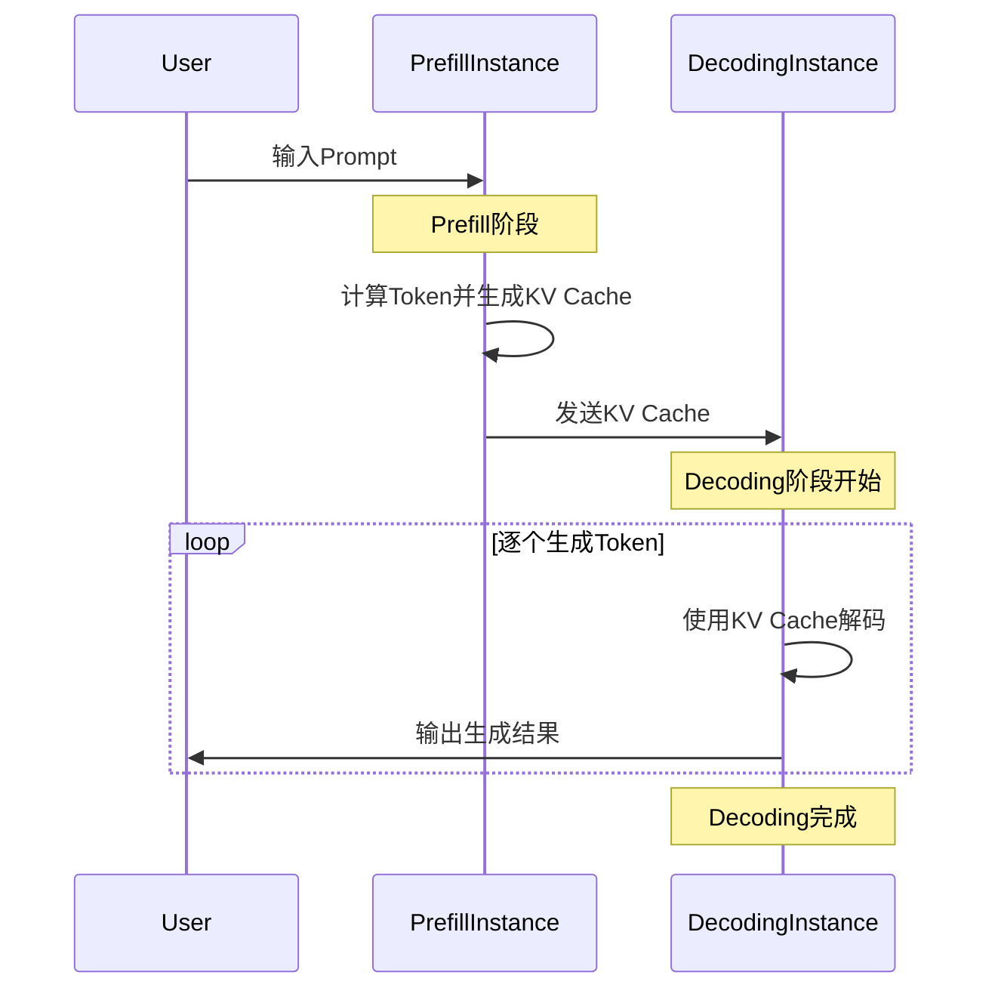

---
# You can also start simply with 'default'
theme: neversink
layout: intro
routerMode: hash
color: light
---

# DistServe

**Disaggregating Prefill and Decoding for  Goodput-optimized Large Language Model Serving**

<!--
分享DistServe
把大模型的Prefill和Decoding拆分
Prefill->输入提示词，输出第一个Token
Decoding->一个一个输出Token
-->

---
layout: two-cols-title
columns: is-6
align: l-lt-lt
---

::title::

# Prefill&Decoding
[Attention-3Blue1Brown](https://www.bilibili.com/video/BV1TZ421j7Ke)

::left::

::right::

<!--
Token embeding之后形成向量，向量乘以WQ,WK，之后如图进行点乘，SoftMax之后乘矩阵V，得到DeltaE，把DeltaE加入原始的嵌入向量
-->

---
layout: default
---

# Prefill&Decoding

[**大语言模型如何储存事实-3Blue1Brown**](https://www.bilibili.com/video/BV1aTxMehEjK)

<!--
mlp依然是大量的矩阵乘法，这个过程各个vector之间并不产生关系
-->

---
layout: default
---

---
layout: two-cols-title
columns: is-5
align: lm-lm-lm
---

::title::
# 💰😭

::left::

::right::

木桶效应，达到预设的SLO（TFTT和TPOT的时延要求），Exising System: 1.6 reqs/s

🤔 拆开prefill和decoding阶段，如图，给每个decoding分配多个prefill，可以节省GPU（提升了利用率）

<!--
在一台NVIDIA 80GB A100上，在输入长度=512，输出长度=64的合成工作负载下为具有13B参数的LLM提供服务时的性能。上：比较现有系统与仅服务于预填充阶段的系统的P90time-per-output-token（TTFT）延迟。下：比较现有系统与仅服务于解码阶段的系统的P90time-per-output-token（TPOT）延迟。
-->

---
layout: two-cols-title
colunms: is-5
align: lt-lm-lm
---

::title::

# Batching

Batch requests in prefill and decoding phase together

::left::

::right::

Batching prefill and decoding phase together hurt both TTFT and TPOT

Prefill: Compute-bound

Decoding: Memory-bound

批处理这两个阶段使它们共享相同的并行策略，难以同时优化TTFT和TOPT

::default::

---
layout: two-cols-title
colunms: is-4
align: lt-lm-lm
---

::title::
# Opportunity: Disaggregating Prefill and Decoding

::left::

::right::

---
layout: default
---
# A100 80G = 🚗

---
layout: default
---

---
layout: full
---

---
layout: default
---

# kv-cache传输开销

---
color: light
layout: top-title
align: l
---

:: title ::

# 算法实现

:: content ::

---
layout: default
---

---
layout: default
---

---
layout: default
---

---
layout: default
---

---
layout: default
---

 

# Deepseek already apply the same idea!!!

[DeepSeek-V3 / R1 推理系统概览](https://zhuanlan.zhihu.com/p/27181462601)

